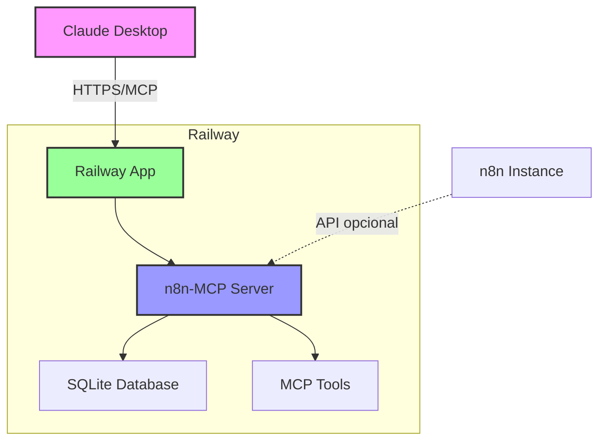

# 🚂 Deploy do n8n-MCP no Railway

> Documentação completa para deploy profissional do servidor MCP (Model Context Protocol) do n8n no Railway.

## 📋 Índice

- [Visão Geral](#-visão-geral)
- [Pré-requisitos](#-pré-requisitos)
- [Arquitetura do Sistema](#-arquitetura-do-sistema)
- [Guia de Deploy Rápido](#-guia-de-deploy-rápido)
- [Configuração Detalhada](#-configuração-detalhada)
- [Variáveis de Ambiente](#-variáveis-de-ambiente)
- [Segurança e Boas Práticas](#-segurança-e-boas-práticas)
- [Integração com Claude Desktop](#-integração-com-claude-desktop)
- [Monitoramento e Logs](#-monitoramento-e-logs)
- [Solução de Problemas](#-solução-de-problemas)
- [Otimizações de Performance](#-otimizações-de-performance)
- [Custos e Escalabilidade](#-custos-e-escalabilidade)

## 🎯 Visão Geral

O **n8n-MCP** é um servidor Model Context Protocol que fornece aos assistentes de IA (como Claude) acesso completo à documentação, propriedades e operações dos 525+ nodes do n8n. Este guia detalha como fazer o deploy no Railway de forma profissional e segura.

### Por que Railway?

- ✅ **Deploy Simples**: Integração direta com GitHub
- ✅ **SSL Automático**: HTTPS incluído sem configuração
- ✅ **Escalabilidade**: Auto-scaling baseado em uso
- ✅ **Monitoramento**: Logs e métricas em tempo real
- ✅ **Custo-efetivo**: Plano gratuito generoso ($5/mês de créditos)
- ✅ **Suporte a Docker**: Deploy com Dockerfile otimizado

## 📦 Pré-requisitos

1. **Conta no Railway**: [railway.app](https://railway.app)
2. **Conta no GitHub**: Para fork do repositório
3. **Instância n8n** (opcional): Para recursos de gerenciamento
4. **Claude Desktop**: Para usar o MCP após o deploy

## 🏗️ Arquitetura do Sistema



### Componentes Principais

1. **MCP Server**: Servidor HTTP que implementa o protocolo MCP
2. **SQLite Database**: Base de dados com informações de todos os nodes do n8n
3. **MCP Tools**: 39 ferramentas disponíveis (23 de documentação + 16 de gerenciamento)
4. **Docker Container**: Imagem otimizada de apenas 280MB

## 🚀 Guia de Deploy Rápido

### 1. Fork do Repositório

```bash
# Fork o repositório oficial
https://github.com/czlonkowski/n8n-mcp

# Clone seu fork
git clone https://github.com/SEU-USUARIO/n8n-mcp.git
cd n8n-mcp
```

### 2. Deploy no Railway

#### Opção A: Deploy via GitHub (Recomendado)

1. Acesse [railway.app](https://railway.app)
2. Clique em "New Project"
3. Selecione "Deploy from GitHub repo"
4. Autorize o Railway a acessar seu GitHub
5. Selecione o repositório `n8n-mcp`
6. Railway detectará automaticamente o Dockerfile

#### Opção B: Deploy via CLI

```bash
# Instale o Railway CLI
npm install -g @railway/cli

# Faça login
railway login

# Inicie um novo projeto
railway init

# Deploy
railway up
```

### 3. Configuração de Variáveis de Ambiente

No painel do Railway, vá em "Variables" e adicione:

```env
# Configuração Essencial
MCP_MODE=http
AUTH_TOKEN=seu-token-seguro-aqui
USE_FIXED_HTTP=true
PORT=3000

# Logging
LOG_LEVEL=info
NODE_ENV=production

# Opcional: Integração com n8n
N8N_API_URL=https://sua-instancia-n8n.com
N8N_API_KEY=sua-api-key-n8n
```

#### Gerando um Token Seguro

```bash
# Linux/Mac
openssl rand -base64 32

# Ou use um gerador online seguro
```

### 4. Verificar Deploy

Após o deploy, você receberá uma URL como:
```
https://seu-app.up.railway.app
```

Teste o health check:
```bash
curl https://seu-app.up.railway.app/health
```

Resposta esperada:
```json
{
  "status": "ok",
  "mode": "http",
  "timestamp": "2025-01-08T13:30:00.000Z"
}
```

## ⚙️ Configuração Detalhada

### railway.toml

O arquivo `railway.toml` já está otimizado no repositório:

```toml
[build]
builder = "dockerfile"
dockerfilePath = "Dockerfile"

[deploy]
startCommand = "node dist/mcp/index.js"
healthcheckPath = "/health"
healthcheckTimeout = 100
restartPolicyType = "ON_FAILURE"
restartPolicyMaxRetries = 10

[[services]]
name = "mcp"
port = 3000
```

### Dockerfile Otimizado

O projeto inclui um Dockerfile ultra-otimizado:
- 🚀 **Apenas 280MB** (82% menor que imagens típicas)
- 🔒 **Usuário não-root** para segurança
- 📦 **Sem dependências do n8n** em runtime
- ⚡ **Build em cache** para deploys rápidos

## 🔐 Variáveis de Ambiente

### Variáveis Obrigatórias

| Variável | Descrição | Exemplo |
|----------|-----------|---------||
| `MCP_MODE` | Modo de operação | `http` |
| `AUTH_TOKEN` | Token de autenticação | `token-seguro-32-chars` |
| `USE_FIXED_HTTP` | Usar implementação estável | `true` |

### Variáveis Opcionais

| Variável | Descrição | Padrão |
|----------|-----------|--------|
| `PORT` | Porta do servidor | `3000` |
| `LOG_LEVEL` | Nível de log | `info` |
| `NODE_ENV` | Ambiente | `production` |
| `TRUST_PROXY` | Confiar em proxy reverso | `1` |
| `N8N_API_URL` | URL da instância n8n | - |
| `N8N_API_KEY` | API Key do n8n | - |
| `N8N_API_TIMEOUT` | Timeout das requisições | `30000` |

### Configuração de Segurança

```env
# Segurança básica
AUTH_TOKEN=gere-um-token-aleatorio-seguro-aqui
TRUST_PROXY=1  # Railway usa proxy reverso

# Para ambientes de produção
NODE_ENV=production
LOG_LEVEL=warn  # Reduz logs sensíveis
```

## 🛡️ Segurança e Boas Práticas

### 1. Autenticação

- ✅ **Sempre** use um AUTH_TOKEN forte (32+ caracteres)
- ✅ Rotacione tokens periodicamente
- ✅ Use variáveis de ambiente, nunca hardcode

### 2. Rede

- ✅ Railway fornece SSL/TLS automaticamente
- ✅ Configure TRUST_PROXY=1 para logging correto de IPs
- ✅ Use allowlist de IPs se necessário (Railway Pro)

### 3. Monitoramento

- ✅ Configure alertas para falhas de health check
- ✅ Monitore uso de memória (limite: 512MB)
- ✅ Acompanhe logs de erro regularmente

### 4. Backup

- ✅ O database é read-only (não precisa backup)
- ✅ Mantenha backup das variáveis de ambiente
- ✅ Documente configurações customizadas

## 🖥️ Integração com Claude Desktop

### 1. Obtenha a URL do Railway

No painel do Railway, copie a URL pública do seu app.

### 2. Configure o Claude Desktop

Edite o arquivo de configuração do Claude:

**Windows**: `%APPDATA%\Claude\claude_desktop_config.json`
**macOS**: `~/Library/Application Support/Claude/claude_desktop_config.json`
**Linux**: `~/.config/Claude/claude_desktop_config.json`

```json
{
  "mcpServers": {
    "n8n-remote": {
      "command": "npx",
      "args": [
        "-y",
        "@modelcontextprotocol/mcp-remote@latest",
        "connect",
        "https://seu-app.up.railway.app/mcp"
      ],
      "env": {
        "MCP_AUTH_TOKEN": "seu-auth-token-aqui"
      }
    }
  }
}
```

### 3. Reinicie o Claude Desktop

Após salvar a configuração, reinicie o Claude Desktop para carregar o MCP.

### 4. Teste a Conexão

No Claude, digite:
```
Você pode usar a ferramenta tools_documentation para me mostrar as ferramentas disponíveis?
```

## 📊 Monitoramento e Logs

### Visualizar Logs no Railway

```bash
# Via CLI
railway logs

# Ou no painel web
# Projeto > Deployments > View Logs
```

### Logs Importantes para Monitorar

1. **Inicialização**:
   ```
   Starting n8n Documentation MCP Server in http mode...
   HTTP server listening on port 3000
   ```

2. **Requisições de Autenticação**:
   ```
   Authentication successful from IP: xxx.xxx.xxx.xxx
   Authentication failed from IP: xxx.xxx.xxx.xxx
   ```

3. **Erros de Database**:
   ```
   Error loading database: ...
   ```

### Métricas no Railway

O Railway fornece métricas automáticas:
- 📈 CPU Usage
- 💾 Memory Usage
- 🌐 Network I/O
- ⏱️ Response Time

## 🔧 Solução de Problemas

### Problema 1: "Authentication failed"

**Sintomas**: Claude não consegue se conectar

**Soluções**:
1. Verifique se o AUTH_TOKEN está correto em ambos os lados
2. Confirme que está usando MCP_AUTH_TOKEN no Claude (não AUTH_TOKEN)
3. Verifique se não há espaços extras no token

### Problema 2: "Connection refused"

**Sintomas**: Timeout ao conectar

**Soluções**:
1. Verifique se o deploy está ativo no Railway
2. Teste o health check: `curl https://seu-app.up.railway.app/health`
3. Verifique os logs do Railway para erros

### Problema 3: "Out of memory"

**Sintomas**: App reinicia frequentemente

**Soluções**:
1. Aumente o limite de memória no Railway (pode requerer plano pago)
2. Verifique se LOG_LEVEL não está em "debug" em produção
3. Monitore padrões de uso

### Problema 4: "Database not found"

**Sintomas**: Erro 500 ao acessar ferramentas

**Soluções**:
1. Verifique se o arquivo `data/nodes.db` existe no repositório
2. Rebuilde a imagem Docker: `railway up --build`
3. Verifique permissões do arquivo

## ⚡ Otimizações de Performance

### 1. Cache de Respostas

O servidor já implementa cache inteligente:
- Respostas de nodes são cacheadas por 1 hora
- Database é carregado em memória na inicialização

### 2. Configurações Recomendadas

```env
# Para melhor performance
NODE_ENV=production
LOG_LEVEL=warn  # Reduz I/O de logs
REBUILD_ON_START=false  # Database já está pronto
```

### 3. Escalabilidade

Railway permite auto-scaling baseado em:
- CPU usage > 80%
- Memory usage > 80%
- Response time > 1s

Configure no painel: Settings > Scaling

## 💰 Custos e Escalabilidade

### Plano Gratuito do Railway

- ✅ $5/mês em créditos grátis
- ✅ 500 horas de execução
- ✅ 100GB de bandwidth
- ✅ SSL automático incluído

### Estimativa de Custos

Para uso típico do n8n-MCP:
- **CPU**: ~0.1 vCPU = $0.50/mês
- **RAM**: 512MB = $2.50/mês
- **Total**: ~$3/mês (dentro do plano gratuito)

### Quando Escalar

Considere upgrade quando:
- 🚀 > 1000 requisições/hora
- 👥 > 10 usuários simultâneos
- 💾 Logs indicam falta de memória

## 📚 Recursos Adicionais

### Links Úteis

- [Documentação do Railway](https://docs.railway.app)
- [n8n-MCP no GitHub](https://github.com/czlonkowski/n8n-mcp)
- [Model Context Protocol](https://modelcontextprotocol.io)
- [n8n Documentation](https://docs.n8n.io)

### Suporte

- **Issues**: [GitHub Issues](https://github.com/czlonkowski/n8n-mcp/issues)
- **Discussions**: [GitHub Discussions](https://github.com/czlonkowski/n8n-mcp/discussions)
- **Railway**: [Status Page](https://status.railway.app)

## 🎉 Conclusão

Parabéns! Você agora tem um servidor n8n-MCP profissional rodando no Railway. Com esta configuração, você pode:

- ✅ Usar todas as 39 ferramentas MCP no Claude
- ✅ Acessar documentação de 525+ nodes do n8n
- ✅ Validar e criar workflows programaticamente
- ✅ Escalar conforme necessário

### Próximos Passos

1. **Teste as ferramentas** no Claude Desktop
2. **Configure monitoring** para produção
3. **Documente** suas integrações específicas
4. **Contribua** com melhorias no projeto

---

<div align="center">
  <strong>Criado com ❤️ para a comunidade n8n</strong><br>
  <sub>Tornando a criação de workflows com IA uma delícia</sub>
</div>